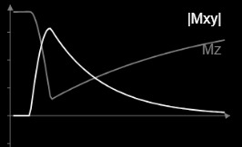
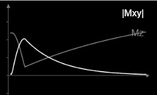

# MRI-Magnetization-Vector-Simulation
# Bloch Equation Matrix Simulator

## Table of Contents
1. [Part 1: The Fundamentals](#part-1-the-fundamentals)
   - [Description of Technology](#description-of-technology)
   - [Description of the Process](#description-of-the-process)
2. [Part 2: The Extras (Context & Depth)](#part-2-the-extras-context--depth)
   - [How the Project Came About](#how-the-project-came-about)
   - [The Motivation](#the-motivation)
   - [What Problem It Hopes to Solve](#what-problem-it-hopes-to-solve)
   - [What the Intended Use Is](#what-the-intended-use-is)
   - [Challenges](#challenges)
   - [Limitations](#limitations)
   - [Credits](#credits)
3. [Part 3: Model Validation](#part-3-model-validation)

---

## Part 1: The Fundamentals

### Description of Technology
This simulation is built entirely in **Python**, utilizing two primary scientific libraries:
* **NumPy:** For handling heavy matrix multiplications, linear algebra operations, and multi-dimensional array generation.
* **Matplotlib:** For rendering both 2D relaxation envelopes and generating the 3D spatial trajectories.

**Why these tools?**
Python, specifically paired with NumPy, is the undisputed standard for data science applications in healthcare. Choosing this stack ensures the code is highly performant for mathematical modeling while remaining readable and scalable for future integration into clinical neuroinformatics pipelines. Matplotlib natively supports complex 3D rendering without requiring external game engines or heavy dependencies.

### Description of the Process
The script simulates the Bloch equations by discarding simple closed-form analytical formulas in favor of a step-by-step numerical matrix solution. It defines a 3x3 rotation and relaxation matrix alongside a longitudinal recovery vector. The program iteratively calculates the state of the magnetization vector by taking the state from the previous fraction of a millisecond and applying the matrix transformation. 

**Why this approach?**
While analytical formulas like $M_{xy} = M_0 e^{-t/T_2}$ are mathematically perfect for static environments, they fail in dynamic systems. The iterative matrix methodology was explicitly chosen because it mimics how real MRI systems operate—allowing developers to introduce dynamic changes (like $180^{\circ}$ RF refocusing pulses or changing gradients) mid-simulation simply by altering the matrix at a specific time step.

---

## Part 2: The Extras (Context & Depth)

### How the project came about
This repository was developed as part of the *Imaging without Borders* Imagine Summer School (June–August 2026). The curriculum challenged participants to code mathematical models simulating tissue relaxation behaviors from fundamental physics principles. 

### The Motivation
As an early career computational neuroscientist, the overarching drive behind developing robust simulation models is to bridge the gap between clinical practice and advanced data science in the African context. Building ground-up simulators builds the foundational knowledge required to eventually integrate artificial intelligence and complex neuroimaging into accessible, localized clinical tools.

### What problem it hopes to solve
Standard plotting scripts often suffer from severe Nyquist aliasing when attempting to visualize high-frequency phenomena (like a 42.58 MHz Larmor precession) over several seconds. This project solves that visual artifacting problem by cleanly separating the mathematical arrays used for physical measurement from the scaled-down arrays used for 3D visualization, resulting in smooth, accurate spiral trajectories.

### What the intended use is
This tool is intended to serve as an educational visualizer for medical students, researchers, and next-gen innovators to explore how variations in $T_1$, $T_2$, and $B_0$ parameters mechanically affect magnetization without requiring access to an actual MRI suite. 

### Challenges
The primary conceptual roadblock was transitioning the mathematical approach from a static state-calculation to a temporal, continuous loop. Additionally, rendering the 3D spiral without crashing the JupyterLab environment required balancing the sampling rate (dt) with a visually digestible effective frequency. 

### Limitations
In its current state, the simulator models only Free Induction Decay (FID) and relaxation. It currently **does not**:
* Simulate the application of spatial encoding gradients.
* Model off-resonance effects or magnetic field inhomogeneities ($T_2^*$).
* Accept interactive, mid-simulation RF pulses. 

### Credits
* **Imagine Summer School:** For the core curriculum, problem sets, and foundational assignments.

---

## Part 3: Model Validation

To verify the accuracy of the numerical matrix simulation, the Python outputs were cross-validated against the established [DRCMR Bloch Simulator](https://www.drcmr.dk/BlochSimulator/). The spatial trajectories and relaxation envelopes generated by this custom algorithm accurately match the web-based clinical standard for varying tissue moieties.
<table>
  <tr>
    <td align="center">
      <strong>Moiety A ($T_1=3s, T_2=1s$)</strong> 
      
    </td>
    <td align="center">
      <strong>Moiety B ($T_1=1.5s, T_2=0.1s$)</strong> 
      
    </td>
  </tr>
</table>
